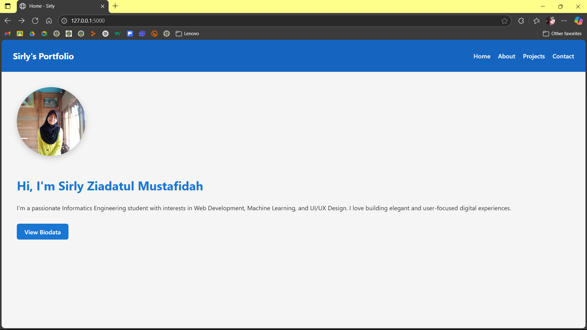
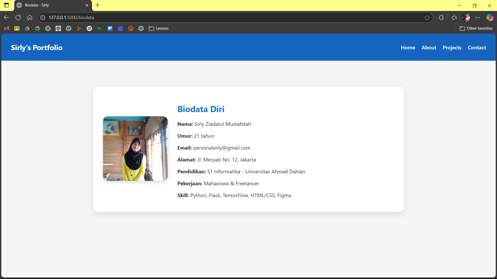

# 🧑‍💻 Personal Profile Web App

Ini adalah aplikasi web personal profile menggunakan **Flask**. Aplikasi ini menampilkan halaman home, biodata, about, projects, dan contact dengan tampilan modern dan responsif.

---

## 📦 Fitur:
- Navigasi antar halaman (navbar)
- Halaman Home dengan deskripsi singkat dan tombol "View Biodata"
- Halaman Biodata dalam bentuk **kartu dengan foto**
- Desain bersih, responsif, dan mudah dikembangkan

---

## 🚀 Instalasi & Menjalankan Aplikasi

### 1. Clone Repo

```bash
git clone https://github.com/sirly82/personal-profile-flask.git
cd personal-profile-flask
```

### 2. Buat dan Aktifkan Virtual Environment (opsional tapi direkomendasikan)

```bash
python -m venv venv
source venv/bin/activate    # Mac/Linux
venv\Scripts\activate       # Windows
```

### 3. Install Flask

```bash
pip install flask
```

### 4. Jalankan Aplikasi

```bash
python app.py
```

### 5. Buka di Browser

```
http://127.0.0.1:5000
```

---

## 📁 Struktur Folder

```
personal-profile/
├── app.py
├── docs/
│   └── images/
|       ├── biodata.png
│       └── home.png
├── static/
│   ├── style.css
│   └── images/
│       └── profile.jpg
├── templates/
│   ├── base.html
│   ├── home.html
│   ├── about.html
│   ├── projects.html
│   ├── contact.html
│   └── biodata.html
└── README.md
```

---

## 🖼️ Preview Tampilan

### Halaman Home


### Halaman Biodata

